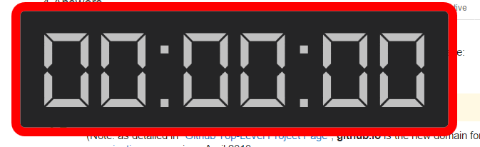
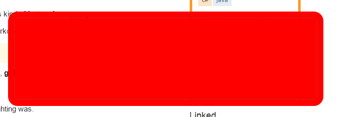

# TimeKeeper (Install : )
This a project I made that helps me keep track of time.
It's a very simple countdown timer.

There is also a **light theme** I use whenever I use Visual Studio (for contrast).

All actions(**Start, Pause, Restart, Reset, Switch Theme and Close**) are done
through the **right-click menu** so that the view isn't cluttered up.

The view changes whenver you need to reset the time

When time is up, an **alarm sound plays** and the **app also flashes red**.

